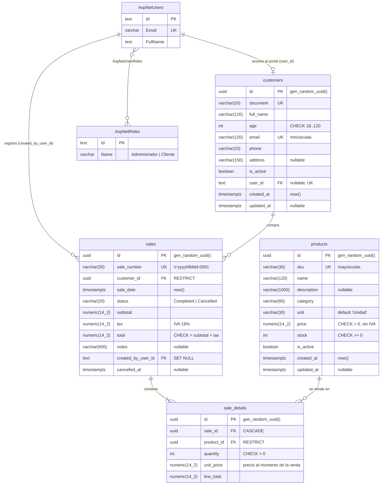
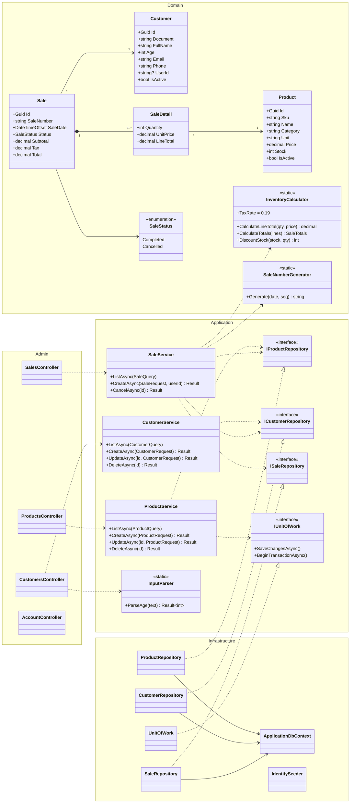
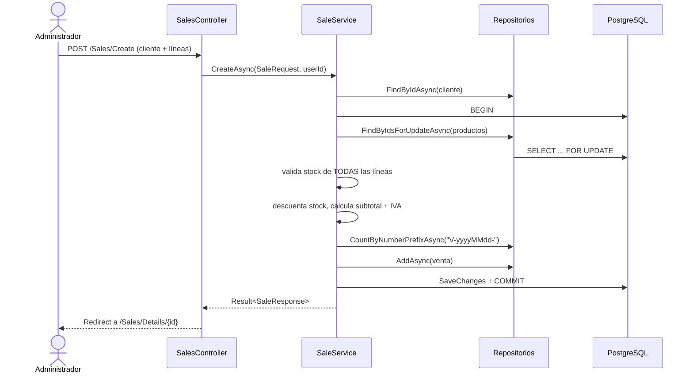

# Diagramas técnicos

Los diagramas están en [Mermaid](https://mermaid.js.org/): GitHub y Rider los dibujan directamente.

## Modelo entidad-relación

Tablas del negocio (snake_case) y su relación con las tablas de Identity. Todo se crea con la
migración `InitialCreate` de EF Core; no hay scripts SQL.

Reglas que el modelo protege:

- Un producto o cliente con ventas **no se puede borrar** (`RESTRICT`): se desactiva con `is_active`.
- `sale_details.unit_price` congela el precio: si el producto cambia de precio, las ventas viejas no cambian.
- Los detalles se borran con su venta (`CASCADE`), pero las ventas nunca se borran: se anulan (`status = Cancelled`) y el stock vuelve al inventario.

## Diagrama de clases (arquitectura limpia)

Las dependencias apuntan hacia adentro: `Admin → Application → Domain`, e `Infrastructure` implementa
las interfaces de `Application`.

## Flujo de una venta

